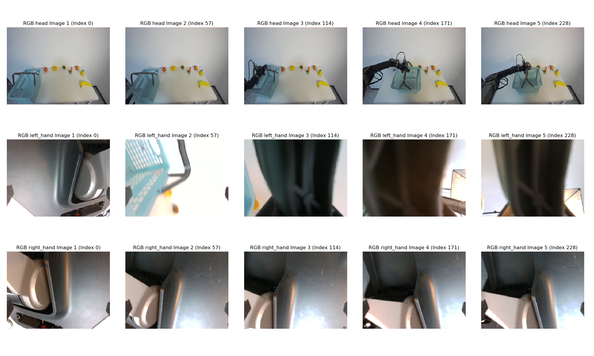
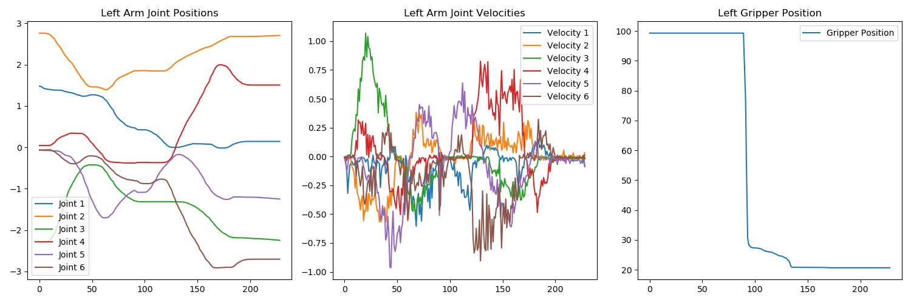
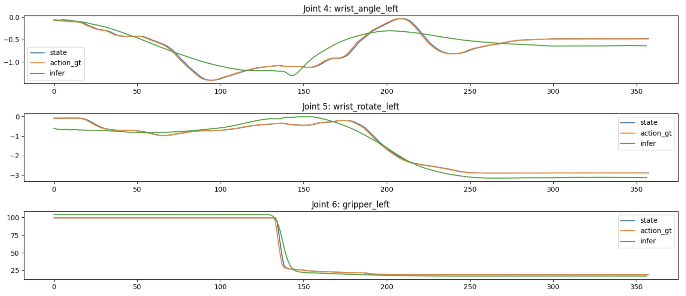

# ACT: Action Chunking with Transformers   *for Galaxea Mobile Manipulator Dataset*

This is a complete adaptation of the ACT pipeline, tailored specifically for GalaXea AI's proprietary bimanual humanoid manipulation dataset: [Galaxea Mobile Manipulator Dataset](https://huggingface.co/datasets/GalaxeaAI/GalaxeaMobileManipulatorDataset). The main functionality includes: 
- Training ACT using .h5 data files
- Evaluating ACT using .h5 data files 
- Evaluating ACT in [Galaxea R1 Simulation Isaac Lab](https://galaxea.ai/Guide/R1/Simulation_Isaac_Lab_Tutorial/#define-observation-action-reward-etc)
- Visualization of training data, training results, and evaluation results

### Repo Structure
- ``imitate_episodes.py`` Train ACT using .h5 files
- ``policy.py`` An adaptor for ACT policy
- ``detr`` Model definitions of ACT, modified from DETR
- ``constants.py`` Constants shared across files
- ``utils.py`` Utils such as data loading and helper functions
- ``play_h5.py`` Evaluate ACT using a .h5 file
- ``infer_issac`` Evaluate ACT in with Isaac Lab in Isaac Sim
- ``visualize_episodes.py`` Visualize states and key frames from a .h5 dataset

### Installation

    conda create -n galaxea_act python=3.8.10
    conda activate galaxea_act
    pip install torchvision
    pip install torch
    pip install pyquaternion
    pip install pyyaml
    pip install rospkg
    pip install pexpect
    pip install mujoco==2.3.7
    pip install dm_control==1.0.14
    pip install opencv-python
    pip install matplotlib
    pip install einops
    pip install packaging
    pip install h5py
    pip install ipython
    cd act4galaxeaDS/detr && pip install -e .

### Example Usages

To set up a new terminal, run:

    conda activate galaxea_act
    cd <path to act repo>

### Instructions

To visualize an episode, run:

    python3 visualize_episodes.py \
    --file_path data/pick_basket/dummy-0001-dummy.h5

It saves key frames of the episode and the entire span of joint positions and velocities etc. in plots.

To __train__ ACT, first add your task config in ``constants.py``, then run:

    python3 imitate_episodes.py \
    --task_name pick_carrot \
    --ckpt_dir ckpt/pick_carrot \
    --policy_class ACT --kl_weight 10 --chunk_size 100 --hidden_dim 512 --batch_size 8 --dim_feedforward 3200 \
    --num_epochs 10000  --lr 1e-5 \
    --seed 0 \
    --img_compressed

[Galaxea Mobile Manipulator Dataset](https://huggingface.co/datasets/GalaxeaAI/GalaxeaMobileManipulatorDataset) saves all the image data in a highly compressed bytes format to significantly reduce file sizes. Thus it requires a decoding process during training. If your image data is not encoded i.e., already in an image array form, simply remove ``--img_compressed``.

To __evaluate__ trained ACT, you can play a .h5 file and it would visualize the difference between the ground truth and the predicted actions:

    python3 play_h5.py \
    --ckpt_dir ckpt/pick_basket \
    --task_name pick_basket \
    --policy_class ACT --kl_weight 10 --chunk_size 100 --hidden_dim 512 --batch_size 8 --dim_feedforward 3200 \
    --num_epochs 2000  --lr 1e-5 \
    --seed 0 \
    --temporal_agg \
    --img_compressed

A successful evaluation should output a smooth inferred action curve (green) aligning with the actual action and state curve (orange & blue):

To evaluate ACT in Isaac Sim, set up the Galaxea R1 Isaac Lab environment following [tutorial](https://galaxea.ai/Guide/R1/Simulation_Isaac_Lab_Tutorial/), and run:

    python3 infer_isaac.py  \
    --task_name pick_apple  \   
    --ckpt_dir ckpt/pick_apple  \
    --policy_class ACT --kl_weight 10 --chunk_size 100 --hidden_dim 512 --batch_size 8 --dim_feedforward 3200 \
    --num_epochs 10000  --lr 1e-5  \ 
    --temporal_agg  \
    --seed 0

A successful evaluation looks like:

For real-world data where things can be harder to model, train for at least 5000 epochs or 3-4 times the length after the loss has plateaued.
Please refer to [tuning tips](https://docs.google.com/document/d/1FVIZfoALXg_ZkYKaYVh-qOlaXveq5CtvJHXkY25eYhs/edit?usp=sharing) for more info.

### Reference:
#### Original Authors' Project Website: https://tonyzhaozh.github.io/aloha/

